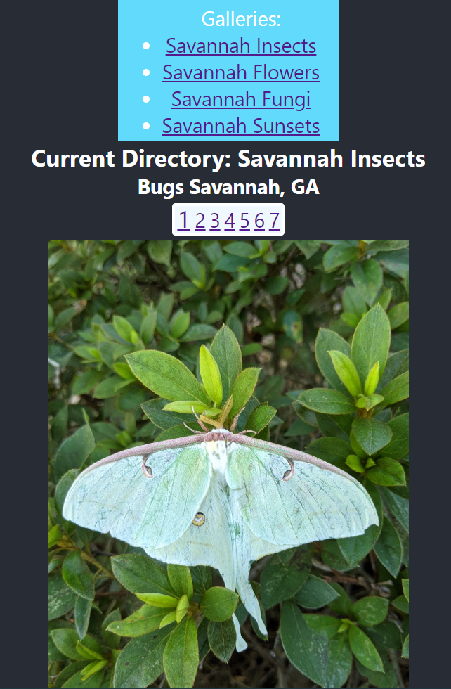

# Sunset Multi-Directory Dynamic Image Gallery

This project consists of two parts: a client and a server. The server is a simple JSON HTML responder responsible for
delivering information about available directories and their contents. The client is a simple photo gallery component that allows the user
to select between the directories supplied by the server.

## Available Scripts

In the project directory, you can run:

### `npm run dev`

Runs the app and the server in development mode concurrently.

## Documentation

### Server
The server, upon running, will scan its configured directory for availiable galleries, determined by a configured token at the beginning of the directory name.
The root directory of the server will serve directory listings, whereas requesting specific directories from the server will get you their contents.